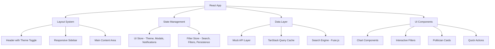

# Design Document

## Overview

This design document outlines the technical approach for implementing comprehensive improvements to the Insight Intelligence Dashboard. The project is a React-based political sentiment analysis platform for Nigeria that currently has solid foundations but requires critical fixes and enhancements to transform it from a 60-70% complete MVP into a polished, production-ready demonstration platform.

The design focuses on fixing broken functionality (dark mode, search, empty data sections), enhancing user experience, and implementing missing core features while maintaining the existing architecture and leveraging the comprehensive mock data system already in place.

## Architecture

### Current Architecture Analysis

The project uses a modern React architecture with:
- **Frontend Framework**: React 19.1.0 with TypeScript
- **Styling**: UnoCSS (migrated from Tailwind) with custom shortcuts and theme system
- **State Management**: Zustand for UI state and filters with persistence
- **Data Fetching**: TanStack Query (React Query) for async state management
- **Routing**: React Router DOM v7
- **Charts**: Recharts for data visualizations
- **Search**: Fuse.js for fuzzy search capabilities
- **Mock Data**: Comprehensive mock data system with realistic Nigerian political context

### Enhanced Architecture Components



## Components and Interfaces

### 1. Theme System Enhancement

**Current State**: Theme toggle exists but non-functional
**Enhancement**: Complete dark mode implementation

```typescript
// Enhanced Theme Interface
interface ThemeConfig {
  mode: 'light' | 'dark';
  colors: {
    background: string;
    foreground: string;
    primary: string;
    secondary: string;
    accent: string;
    muted: string;
    border: string;
    card: string;
  };
  gradients: {
    primary: string;
    secondary: string;
    accent: string;
  };
}

// CSS Variables Implementation
:root {
  --bg-primary: #ffffff;
  --bg-secondary: #f8fafc;
  --text-primary: #111827;
  --text-secondary: #6b7280;
  --border-color: #e5e7eb;
  --card-bg: #ffffff;
}

[data-theme="dark"] {
  --bg-primary: #0f172a;
  --bg-secondary: #1e293b;
  --text-primary: #f1f5f9;
  --text-secondary: #94a3b8;
  --border-color: #334155;
  --card-bg: #1e293b;
}
```

### 2. Enhanced Search System

**Current State**: Basic search with limited functionality
**Enhancement**: Intelligent fuzzy search with autocomplete

```typescript
// Enhanced Search Interface
interface SearchEngine {
  search(query: string): SearchResult[];
  getSuggestions(query: string): string[];
  getRecentSearches(): string[];
  addToHistory(query: string): void;
}

// Fuse.js Configuration
const searchConfig = {
  keys: [
    { name: 'name', weight: 0.4 },
    { name: 'party', weight: 0.3 },
    { name: 'position', weight: 0.2 },
    { name: 'state', weight: 0.1 }
  ],
  threshold: 0.3,
  includeScore: true,
  includeMatches: true
};
```

### 3. Image Placeholder System

**Current State**: Broken politician images
**Enhancement**: Reliable placeholder system

```typescript
// Image Placeholder Utility
interface ImageConfig {
  width: number;
  height: number;
  backgroundColor?: string;
  textColor?: string;
  text?: string;
}

const generatePlaceholderUrl = (config: ImageConfig): string => {
  const { width, height, backgroundColor = '3b82f6', textColor = 'ffffff', text } = config;
  const displayText = text || `${width}x${height}`;
  return `https://placehold.co/${width}x${height}/${backgroundColor}/${textColor}.png?text=${encodeURIComponent(displayText)}`;
};

// Politician Image Component
const PoliticianImage: React.FC<{
  politician: Politician;
  size?: 'sm' | 'md' | 'lg';
  className?: string;
}> = ({ politician, size = 'md', className }) => {
  const dimensions = {
    sm: { width: 40, height: 40 },
    md: { width: 80, height: 80 },
    lg: { width: 120, height: 120 }
  };
  
  const { width, height } = dimensions[size];
  const placeholderUrl = generatePlaceholderUrl({
    width,
    height,
    text: politician.name.split(' ').map(n => n[0]).join('')
  });
  
  return (
     {
        e.currentTarget.src = placeholderUrl;
      }}
    />
  );
};
```

### 4. Interactive Chart Filters

**Current State**: Non-functional time period filters
**Enhancement**: Dynamic chart updates with filter state

```typescript
// Chart Filter Interface
interface ChartFilter {
  timeRange: '7d' | '30d' | '3m' | '1y';
  platforms?: SocialPlatform[];
  parties?: PoliticalParty[];
  states?: NigerianState[];
}

// Enhanced Chart Component
const SentimentChart: React.FC<{
  filter: ChartFilter;
  onFilterChange: (filter: ChartFilter) => void;
}> = ({ filter, onFilterChange }) => {
  const { data, isLoading } = useQuery({
    queryKey: ['sentiment-data', filter],
    queryFn: () => fetchSentimentData(filter),
    staleTime: 5 * 60 * 1000
  });
  
  return (
    <div className="chart-container">
      <div className="flex justify-between items-center mb-4">
        <h3 className="text-lg font-semibold">Sentiment Trends</h3>
        <select 
          value={filter.timeRange}
          onChange={(e) => onFilterChange({
            ...filter,
            timeRange: e.target.value as ChartFilter['timeRange']
          })}
          className="border rounded px-3 py-1"
        >
          <option value="7d">Last 7 days</option>
          <option value="30d">Last 30 days</option>
          <option value="3m">Last 3 months</option>
          <option value="1y">Last year</option>
        </select>
      </div>
      {/* Chart implementation */}
    </div>
  );
};
```

### 5. Navigation Enhancement

**Current State**: Unresponsive settings and notifications icons
**Enhancement**: Functional navigation with modals/panels

```typescript
// Navigation Action Interface
interface NavigationAction {
  type: 'settings' | 'notifications' | 'profile';
  handler: () => void;
  badge?: number;
}

// Settings Modal Component
const SettingsModal: React.FC<{
  isOpen: boolean;
  onClose: () => void;
}> = ({ isOpen, onClose }) => {
  const { theme, setTheme } = useUIStore();
  
  return (
    <Modal isOpen={isOpen} onClose={onClose}>
      <div className="p-6">
        <h2 className="text-xl font-bold mb-4">Settings</h2>
        <div className="space-y-4">
          <div>
            <label className="block text-sm font-medium mb-2">Theme</label>
            <select 
              value={theme}
              onChange={(e) => setTheme(e.target.value as 'light' | 'dark')}
              className="w-full border rounded px-3 py-2"
            >
              <option value="light">Light</option>
              <option value="dark">Dark</option>
            </select>
          </div>
          {/* Additional settings */}
        </div>
      </div>
    </Modal>
  );
};
```

### 6. Quick Actions Implementation

**Current State**: Non-functional quick action buttons
**Enhancement**: Functional navigation with proper routing

```typescript
// Quick Actions Configuration
interface QuickAction {
  id: string;
  label: string;
  description: string;
  icon: React.ComponentType;
  route: string;
  params?: Record<string, string>;
}

const quickActions: QuickAction[] = [
  {
    id: 'trending-topics',
    label: 'View Trending Topics',
    description: 'See what\'s trending in Nigerian politics',
    icon: TrendingUpIcon,
    route: '/trending'
  },
  {
    id: 'compare-parties',
    label: 'Compare Parties',
    description: 'Analyze party performance side-by-side',
    icon: ScaleIcon,
    route: '/party'
  },
  {
    id: 'positive-politicians',
    label: 'Most Positive Politicians',
    description: 'Politicians with highest positive sentiment',
    icon: HeartIcon,
    route: '/search',
    params: { filter: 'positive', sort: 'sentiment' }
  }
];
```

### 7. Refresh Functionality

**Current State**: No manual refresh capability
**Enhancement**: Subtle refresh button with state preservation

```typescript
// Refresh Interface
interface RefreshState {
  isRefreshing: boolean;
  lastRefresh: Date;
  error?: string;
}

const RefreshButton: React.FC = () => {
  const [refreshState, setRefreshState] = useState<RefreshState>({
    isRefreshing: false,
    lastRefresh: new Date()
  });
  
  const queryClient = useQueryClient();
  
  const handleRefresh = async () => {
    setRefreshState(prev => ({ ...prev, isRefreshing: true, error: undefined }));
    
    try {
      await queryClient.invalidateQueries();
      setRefreshState(prev => ({ 
        ...prev, 
        isRefreshing: false, 
        lastRefresh: new Date() 
      }));
    } catch (error) {
      setRefreshState(prev => ({ 
        ...prev, 
        isRefreshing: false, 
        error: 'Failed to refresh data' 
      }));
    }
  };
  
  return (
    <button
      onClick={handleRefresh}
      disabled={refreshState.isRefreshing}
      className="p-2 text-gray-500 hover:text-gray-700 transition-colors"
      title="Refresh data"
    >
      <ArrowPathIcon 
        className={`h-5 w-5 ${refreshState.isRefreshing ? 'animate-spin' : ''}`} 
      />
    </button>
  );
};
```

## Data Models

### Enhanced Mock Data Structure

The existing mock data system is comprehensive and well-structured. Enhancements focus on filling gaps and improving realism:

```typescript
// Enhanced Politician Profile Data
interface EnhancedPolitician extends Politician {
  sentimentHistory: SentimentDataPoint[];
  trendingTopics: TrendingTopic[];
  demographicBreakdown: DemographicData;
  platformBreakdown: PlatformData[];
  recentActivity: ActivityItem[];
}

// Trending Topics Data
interface TrendingTopic {
  id: string;
  keyword: string;
  mentionCount: number;
  sentiment: SentimentLabel;
  trend: 'rising' | 'falling' | 'stable';
  changePercentage: number;
  relatedPoliticians: string[];
}

// Enhanced Demographic Data
interface DemographicData {
  ageGroups: Record<AgeGroup, number>;
  genderDistribution: Record<Gender, number>;
  stateDistribution: Record<NigerianState, number>;
  platformPreferences: Record<SocialPlatform, number>;
}
```

### Mock Data Generation Utilities

```typescript
// Enhanced Mock Data Generators
class MockDataGenerator {
  static generateSentimentHistory(
    politicianId: string, 
    days: number = 30
  ): SentimentDataPoint[] {
    return Array.from({ length: days }, (_, i) => ({
      date: subDays(new Date(), days - i).toISOString(),
      sentiment: this.generateRealisticSentiment(politicianId, i),
      mentionCount: this.generateMentionCount(politicianId, i),
      platforms: this.generatePlatformBreakdown()
    }));
  }
  
  static generateTrendingTopics(count: number = 10): TrendingTopic[] {
    const topics = [
      'economic policy', 'infrastructure', 'education reform',
      'healthcare', 'security', 'corruption', 'youth empowerment',
      'agriculture', 'technology', 'governance'
    ];
    
    return topics.slice(0, count).map(topic => ({
      id: `topic_${Math.random().toString(36).substr(2, 9)}`,
      keyword: topic,
      mentionCount: Math.floor(Math.random() * 1000) + 100,
      sentiment: this.randomSentiment(),
      trend: this.randomTrend(),
      changePercentage: (Math.random() - 0.5) * 40,
      relatedPoliticians: this.getRandomPoliticianIds(3)
    }));
  }
}
```

## Error Handling

### Comprehensive Error Management System

```typescript
// Error Boundary Component
class DashboardErrorBoundary extends React.Component<
  { children: React.ReactNode },
  { hasError: boolean; error?: Error }
> {
  constructor(props: { children: React.ReactNode }) {
    super(props);
    this.state = { hasError: false };
  }
  
  static getDerivedStateFromError(error: Error) {
    return { hasError: true, error };
  }
  
  componentDidCatch(error: Error, errorInfo: React.ErrorInfo) {
    console.error('Dashboard Error:', error, errorInfo);
    // Log to error reporting service
  }
  
  render() {
    if (this.state.hasError) {
      return (
        <div className="min-h-screen flex items-center justify-center">
          <div className="text-center">
            <h2 className="text-2xl font-bold text-gray-900 mb-4">
              Something went wrong
            </h2>
            <p className="text-gray-600 mb-6">
              We're sorry, but something unexpected happened.
            </p>
            <button
              onClick={() => window.location.reload()}
              className="btn-primary"
            >
              Reload Page
            </button>
          </div>
        </div>
      );
    }
    
    return this.props.children;
  }
}

// API Error Handling
interface APIError {
  code: string;
  message: string;
  details?: unknown;
}

const handleAPIError = (error: unknown): APIError => {
  if (error instanceof Error) {
    return {
      code: 'UNKNOWN_ERROR',
      message: error.message
    };
  }
  
  return {
    code: 'NETWORK_ERROR',
    message: 'Failed to fetch data. Please check your connection.'
  };
};

// Query Error Handling
const queryErrorHandler = (error: unknown) => {
  const apiError = handleAPIError(error);
  
  // Show user-friendly notification
  useNotification().error(
    'Data Loading Failed',
    apiError.message
  );
  
  return apiError;
};
```

### Loading States and Skeletons

```typescript
// Skeleton Components
const PoliticianCardSkeleton: React.FC = () => (
  <div className="animate-pulse">
    <div className="flex items-center space-x-4 p-4">
      <div className="w-12 h-12 bg-gray-200 rounded-full"></div>
      <div className="flex-1">
        <div className="h-4 bg-gray-200 rounded w-3/4 mb-2"></div>
        <div className="h-3 bg-gray-200 rounded w-1/2"></div>
      </div>
    </div>
  </div>
);

const ChartSkeleton: React.FC = () => (
  <div className="animate-pulse">
    <div className="h-6 bg-gray-200 rounded w-1/3 mb-4"></div>
    <div className="h-64 bg-gray-200 rounded"></div>
  </div>
);
```


## Implementation Phases

### Phase 1: Critical Fixes (Requirements 1-3, 10-12)
- Dark mode implementation with CSS variables
- Enhanced search with Fuse.js integration
- Mock data optimization and image placeholders
- Navigation element responsiveness

### Phase 2: Interactive Features (Requirements 4-6, 13)
- Party comparison enhancements
- Politician detail page improvements
- Mobile responsiveness optimization
- Interactive chart filters

### Phase 3: User Experience (Requirements 7-9, 14-15)
- Filter system enhancement
- Performance and loading states
- Error handling and user feedback
- Quick actions and refresh functionality

### Phase 4: Polish and Optimization
- Accessibility improvements
- Performance optimization
- Advanced animations and transitions
- Export and sharing features

This design provides a comprehensive roadmap for transforming the Insight Intelligence Dashboard into a polished, fully functional demonstration platform while maintaining the existing architecture and leveraging the strong foundation already in place.