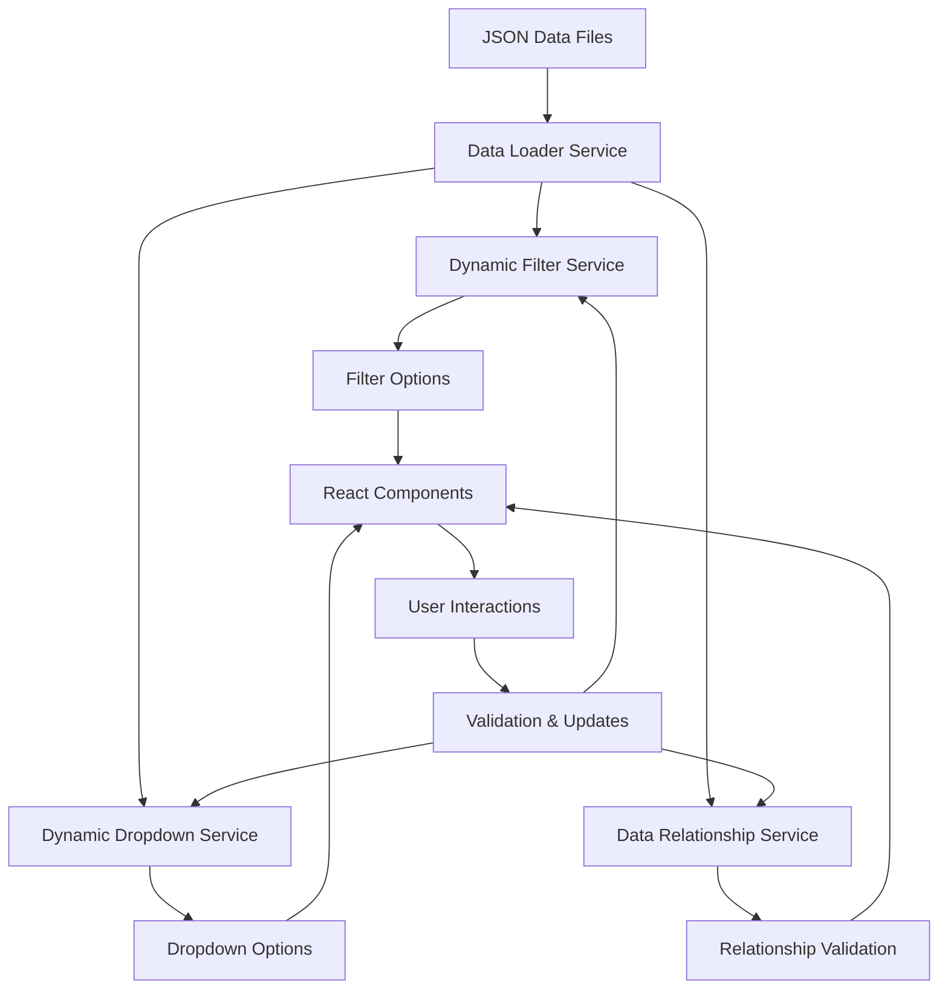

# Dynamic Data Propagation System

## Overview

The Dynamic Data Propagation System is a comprehensive solution for automatically generating filter options, populating dropdowns, and maintaining data relationships in real-time. This system ensures that all UI components stay synchronized with the underlying data and automatically adapt when data changes.

## Architecture

The system consists of three main services that work together:

1. **Dynamic Filter Service** - Generates filter options from JSON data
2. **Dynamic Dropdown Service** - Populates dropdowns with smart search and grouping
3. **Data Relationship Service** - Maintains data integrity and relationships

## Key Features

### 🔄 Real-Time Updates
- Automatic updates when data changes
- Event-driven architecture for instant propagation
- Efficient caching with intelligent invalidation

### 🎯 Smart Validation
- Automatic validation of filter selections
- Data quality assessment and reporting
- Relationship integrity checking

### 📊 Performance Optimization
- Request deduplication to prevent duplicate API calls
- Memory-efficient caching with size limits
- Lazy loading for large datasets

### 🔗 Relationship Management
- Automatic foreign key validation
- Cascade updates for related data changes
- Broken relationship detection and repair

## Services

### Dynamic Filter Service

Automatically generates filter options from JSON data files and provides real-time validation.

```typescript
import { dynamicFilterService } from '../services/dynamic-filter-service';

// Generate filter options for political parties
const partyOptions = await dynamicFilterService.generatePartyOptions();

// Validate filter selections
const validation = dynamicFilterService.validateFilterSelection('party', ['NG-PARTY-APC']);

// Get all filter categories
const categories = await dynamicFilterService.getAllFilterCategories();
```

#### Features:
- **Automatic Option Generation**: Extracts filter options from JSON data
- **Real-Time Validation**: Validates selections against available data
- **Data Quality Assessment**: Rates data quality (excellent, good, fair, poor)
- **Caching**: Intelligent caching with automatic invalidation
- **Event System**: Emits events for real-time updates

#### Supported Data Sources:
- Political parties (`parties.json`)
- Nigerian states (`states.json`)
- Politicians (`politicians.json`)
- Social platforms (from sentiment data)
- Policy topics (from topic trends)

### Dynamic Dropdown Service

Provides smart dropdown functionality with search, grouping, and automatic population.

```typescript
import { dynamicDropdownService } from '../services/dynamic-dropdown-service';

// Register a dropdown
dynamicDropdownService.registerDropdown({
  id: 'political-parties',
  name: 'Political Parties',
  dataSource: 'parties',
  searchable: true,
  multiSelect: true,
  grouped: false,
  sortBy: 'alphabetical',
  sortDirection: 'asc'
});

// Search dropdown options
const results = dynamicDropdownService.searchDropdown('political-parties', 'Congress');

// Select options
dynamicDropdownService.selectOption('political-parties', 'NG-PARTY-APC');
```

#### Features:
- **Smart Search**: Fuzzy search across multiple fields
- **Grouping**: Automatic grouping by categories (e.g., states by region)
- **Sorting**: Multiple sorting options (alphabetical, usage, custom)
- **Virtualization**: Support for large datasets
- **Multi-Select**: Support for single and multi-select dropdowns

#### Built-in Dropdowns:
- `political-parties` - All registered political parties
- `nigerian-states` - All Nigerian states grouped by region
- `politicians` - All politicians grouped by party
- `social-platforms` - Social media platforms
- `policy-topics` - Policy areas and topics

### Data Relationship Service

Maintains data integrity and relationships across all data files.

```typescript
import { dataRelationshipService } from '../services/data-relationship-service';

// Validate a specific relationship
const result = await dataRelationshipService.validateRelationship('politician-party');

// Generate consistency report
const report = await dataRelationshipService.generateConsistencyReport();

// Get related record
const relatedParty = dataRelationshipService.getRelatedRecord('politician-party', 'NG-POL-001');
```

#### Features:
- **Relationship Validation**: Validates foreign key relationships
- **Consistency Monitoring**: Continuous monitoring of data integrity
- **Automatic Repair**: Suggests and applies relationship repairs
- **Cascade Updates**: Propagates changes across related data

#### Predefined Relationships:
- Politician → Party
- Politician → State of Origin
- Politician → Current Position
- LGA → State
- Ward → LGA
- Polling Unit → Ward
- Party Headquarters → State

## React Hooks

### useDynamicFilters

Main hook for using the dynamic filter system in React components.

```typescript
import { useDynamicFilters } from '../hooks/useDynamicFilters';

const MyComponent = () => {
  const {
    categories,
    loadingState,
    statistics,
    validationResults,
    loadCategories,
    validateSelection,
    getFilterOptions
  } = useDynamicFilters({
    enableRealTimeUpdates: true,
    enableValidation: true,
    enableRelationshipChecking: true
  });

  // Use the filter data in your component
  const partyOptions = getFilterOptions('party');
  
  return (
    // Your component JSX
  );
};
```

### useDynamicDropdowns

Hook for managing multiple dropdowns with automatic updates.

```typescript
import { useDynamicDropdowns } from '../hooks/useDynamicFilters';

const MyComponent = () => {
  const {
    dropdowns,
    searchDropdown,
    selectOption,
    getDropdownOptions,
    isDropdownLoading
  } = useDynamicDropdowns([
    'political-parties',
    'nigerian-states',
    'politicians'
  ]);

  return (
    // Your component JSX
  );
};
```

### useDataRelationships

Hook for monitoring and managing data relationships.

```typescript
import { useDataRelationships } from '../hooks/useDynamicFilters';

const MyComponent = () => {
  const {
    consistencyReport,
    generateReport,
    validateRelationship,
    getRelatedRecord
  } = useDataRelationships();

  return (
    // Your component JSX
  );
};
```

## Components

### DynamicFiltersPanel

A complete filter panel component that uses the dynamic filter system.

```typescript
import DynamicFiltersPanel from '../components/filters/DynamicFiltersPanel';

const MyApp = () => {
  return (
    <DynamicFiltersPanel
      variant="panel"
      enableRealTimeUpdates={true}
      enableValidation={true}
      enableRelationshipChecking={true}
    />
  );
};
```

#### Props:
- `variant`: 'panel' | 'sidebar' | 'modal'
- `enableRealTimeUpdates`: Enable automatic updates
- `enableValidation`: Enable filter validation
- `enableRelationshipChecking`: Enable relationship monitoring
- `maxOptionsPerCategory`: Limit options per category

## Data Flow



## Event System

The system uses an event-driven architecture for real-time updates:

### Filter Service Events
- `categoryUpdated` - When filter options are updated
- `categoryError` - When filter loading fails
- `filtersUpdated` - When any filter data changes

### Dropdown Service Events
- `dropdownLoaded` - When dropdown data is loaded
- `dropdownError` - When dropdown loading fails
- `dropdownSelectionChanged` - When selections change

### Relationship Service Events
- `relationshipValidated` - When relationship validation completes
- `dataUpdated` - When data changes affect relationships
- `relationshipsRepaired` - When broken relationships are fixed

## Configuration

### Filter Service Configuration

```typescript
const config = {
  enableRealTimeUpdates: true,
  enableValidation: true,
  enableCaching: true,
  cacheTimeout: 5 * 60 * 1000, // 5 minutes
  maxOptions: 1000,
  minDataQuality: 'fair'
};

const filterService = DynamicFilterService.getInstance(config);
```

### Dropdown Configuration

```typescript
const dropdownConfig = {
  id: 'my-dropdown',
  name: 'My Dropdown',
  dataSource: 'parties',
  searchable: true,
  multiSelect: true,
  grouped: false,
  sortBy: 'alphabetical',
  sortDirection: 'asc',
  maxOptions: 50,
  enableVirtualization: false
};
```

## Performance Considerations

### Caching Strategy
- **Memory-based caching** with configurable TTL
- **Request deduplication** to prevent duplicate API calls
- **Intelligent invalidation** based on data changes

### Optimization Techniques
- **Lazy loading** for large datasets
- **Virtualization** for dropdown options
- **Debounced search** to reduce API calls
- **Efficient event handling** to minimize re-renders

### Memory Management
- **Automatic cleanup** of expired cache entries
- **Size limits** to prevent memory leaks
- **Garbage collection** friendly data structures

## Error Handling

### Graceful Degradation
- **Fallback options** when data loading fails
- **Default values** for missing data
- **User-friendly error messages**

### Validation Errors
- **Detailed error reporting** with suggestions
- **Automatic repair** for common issues
- **Warning system** for data quality issues

### Recovery Mechanisms
- **Automatic retry** for failed requests
- **Cache fallback** when fresh data unavailable
- **Manual refresh** options for users

## Testing

### Unit Tests
```typescript
// Test filter option generation
describe('Dynamic Filter Service', () => {
  it('should generate party filter options', async () => {
    const options = await dynamicFilterService.generatePartyOptions();
    expect(options).toHaveLength(10);
    expect(options[0]).toHaveProperty('value');
    expect(options[0]).toHaveProperty('label');
  });
});
```

### Integration Tests
```typescript
// Test complete data flow
describe('Data Propagation Integration', () => {
  it('should propagate data changes across services', async () => {
    // Simulate data update
    dataLoader.emit('loadSuccess', { key: 'parties', data: newPartyData });
    
    // Verify all services updated
    expect(filterService.getFilterOptions('party')).toHaveLength(11);
    expect(dropdownService.getDropdownOptions('political-parties')).toHaveLength(11);
  });
});
```

## Best Practices

### Data Structure
- **Consistent IDs** across all data files
- **Proper foreign key relationships**
- **Complete metadata** for better user experience

### Performance
- **Enable caching** for frequently accessed data
- **Use virtualization** for large dropdown lists
- **Implement proper cleanup** in component unmount

### User Experience
- **Show loading states** during data fetching
- **Provide search functionality** for large option lists
- **Display data quality indicators** when helpful

### Error Handling
- **Always provide fallbacks** for missing data
- **Show meaningful error messages** to users
- **Implement retry mechanisms** for failed operations

## Migration Guide

### From Static to Dynamic Filters

1. **Replace static filter arrays** with dynamic generation:
```typescript
// Before
const PARTY_OPTIONS = [
  { value: 'APC', label: 'All Progressives Congress' },
  // ...
];

// After
const { getFilterOptions } = useDynamicFilters();
const partyOptions = getFilterOptions('party');
```

2. **Update validation logic**:
```typescript
// Before
const isValidParty = (party) => PARTY_OPTIONS.some(p => p.value === party);

// After
const { validateSelection } = useDynamicFilters();
const validation = validateSelection('party', [party]);
```

3. **Add real-time updates**:
```typescript
// Before - static data, no updates

// After - automatic updates
const { categories } = useDynamicFilters({
  enableRealTimeUpdates: true
});
```

## Troubleshooting

### Common Issues

#### Filter Options Not Loading
- Check data file paths and format
- Verify network connectivity
- Check browser console for errors
- Ensure proper JSON schema validation

#### Validation Errors
- Verify data relationships are correct
- Check for missing or invalid foreign keys
- Ensure data quality meets minimum requirements

#### Performance Issues
- Enable caching if not already enabled
- Reduce maxOptions for large datasets
- Use virtualization for dropdown components
- Check for memory leaks in event listeners

### Debug Tools

```typescript
// Get service statistics
const filterStats = dynamicFilterService.getFilterStatistics();
const dropdownStats = dynamicDropdownService.getDropdownStatistics('my-dropdown');
const relationshipStats = dataRelationshipService.getRelationshipStatistics();

// Generate consistency report
const report = await dataRelationshipService.generateConsistencyReport();
console.log('Data consistency:', report);
```

## Future Enhancements

### Planned Features
- **Real-time collaboration** for multi-user scenarios
- **Advanced analytics** on filter usage patterns
- **Machine learning** for smart filter suggestions
- **Export/import** of filter configurations

### Extensibility
- **Custom data sources** beyond JSON files
- **Plugin system** for custom filter types
- **API integration** for external data sources
- **Custom validation rules** for specific use cases

## Conclusion

The Dynamic Data Propagation System provides a robust, scalable solution for managing filter options, dropdown populations, and data relationships in React applications. By automatically generating options from data and maintaining consistency across the application, it significantly reduces development time and improves user experience.

The system's event-driven architecture ensures that all components stay synchronized, while its comprehensive validation and error handling provide a reliable foundation for data-driven applications.